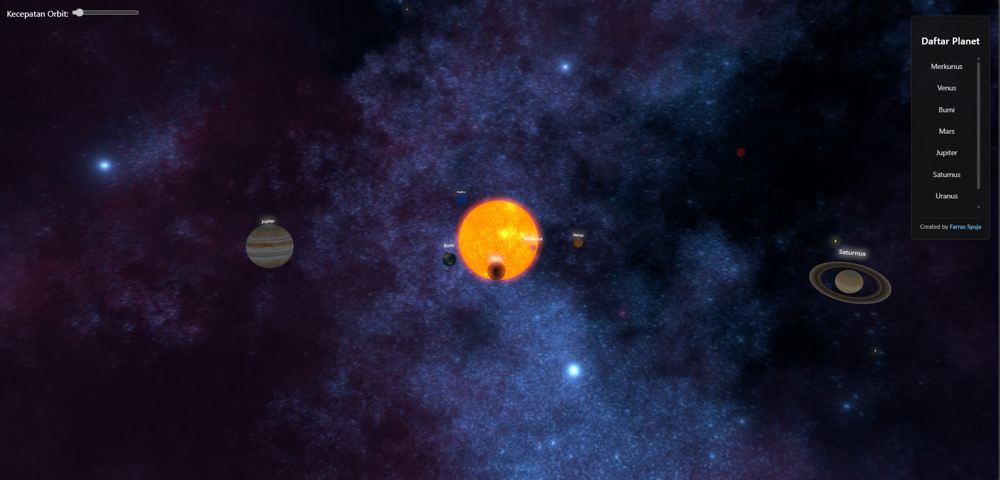
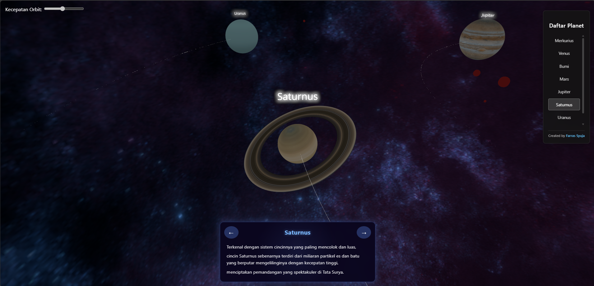
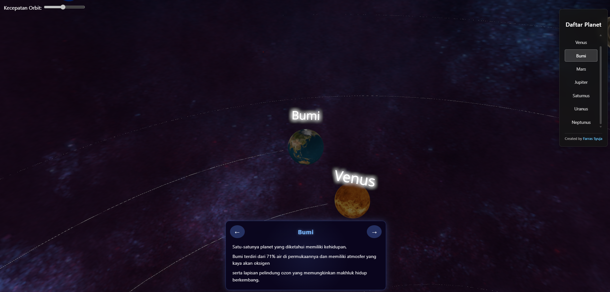

  <h1>🌌 Galaksi Bima Sakti 3D – Simulasi Tata Surya</h1>
  
<a href="https://syujagalaksibimasakti.vercel.app/" target="_blank">🔗 Kunjungi Situs</a>

---

## 🪐 Deskripsi Proyek

Proyek ini adalah simulasi tata surya dari galaksi Bima Sakti yang dibuat dengan **React**, **Vite**, dan **Three.js**. Pengguna dapat melihat planet-planet utama dengan visualisasi 3D yang interaktif, lengkap dengan **fakta unik** tentang setiap planet dan kemampuan untuk mengatur **kecepatan orbit** secara dinamis.

---

## 🚀 Fitur Utama

- 🌍 **Tampilan 3D Planet-Planet**  
  Visualisasi interaktif dari planet-planet dalam galaksi Bima Sakti menggunakan Three.js.

- 🔭 **Fokus Planet**  
  Klik planet untuk memfokuskan kamera dan menampilkan fakta unik tentang planet tersebut.

- ⏱️ **Kontrol Kecepatan Orbit**  
  Pengguna dapat mengatur kecepatan rotasi dan orbit planet melalui antarmuka kontrol.

- 📱 **Desain Responsif**  
  Antarmuka dan elemen interaktif telah dioptimalkan agar nyaman digunakan di perangkat **mobile maupun desktop**.

- 🌗 **Respon Interaktif & Imersif**  
  Menggunakan kontrol kamera yang halus untuk eksplorasi ruang angkasa secara bebas.

---

## 🧰 Teknologi yang Digunakan

- ⚛️ **React** – Antarmuka pengguna
- ⚡ **Vite** – Bundler ringan dan cepat
- 🌌 **Three.js** – Render grafik 3D berbasis WebGL
- 🎯 **React-Three-Fiber** – Binding React untuk Three.js
- 🧪 **Zustand / Redux** – Untuk state management (jika digunakan)

---

## 🖼️ Cuplikan Layar

---

## 🧑‍💻 Kontributor

Proyek ini dikembangkan oleh:

**👨‍🚀 Farras Syuja** – Fullstack Developer, 3D Explorer  
✉️ syujafarras@gmail.com  
🌐 [syujagalaksibimasakti.vercel.app](https://syujagalaksibimasakti.vercel.app)

---

## 📜 Lisensi

MIT License © 2025 Farras Syuja

Redistribusi dan penggunaan dalam bentuk kode sumber dan bentuk biner diizinkan dengan syarat berikut:

- **Wajib mencantumkan atribusi kepada pembuat asli, Farras Syuja.**
- **Tidak diperbolehkan menggunakan proyek ini untuk keperluan komersial tanpa izin tertulis.**

Untuk penggunaan komersial, silakan hubungi: **syujafarras@gmail.com**

---
